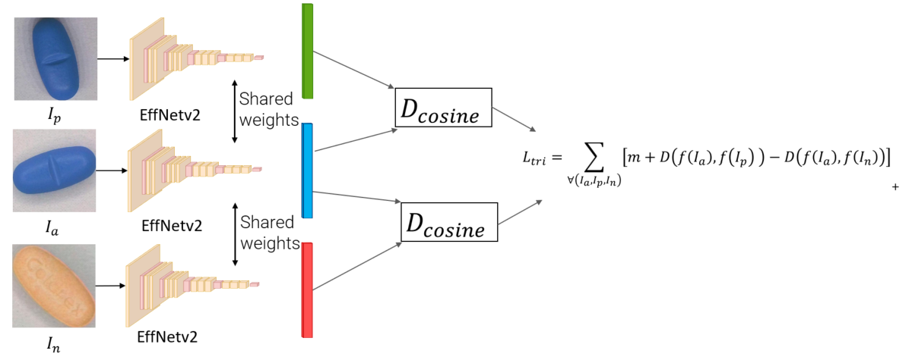

# Pill Metrics Learning with Multihead Attention

## ⚠️ Important Notice

> **Branch Status Update**  
> - `idaacs2023` and `kdir2023`: **Up to date**  
> - Other branches: **Undergoing revision**  
>   
> Please use the specified branches for stable, current functionality. Changes in other branches may impact code stability until rewrites are complete.


In object recognition, especially, when new classes can easily appear during the application, few-shot learning has 
great importance. Metrics learning is an important elementary technique for few-shot object recognition which can be 
applied successfully for pill recognition. To enforce the exploitation of different object features we use 
multi-stream metrics learning networks for pill recognition in our article. We investigate the usage of 
multihead attention layers at different parts of the network. The performance is analyzed on two datasets with 
superior results to a state-of-the-art multi-stream pill recognition network.

## Architecture of the model

The main idea behind multi-stream processing is to persuade the sub-networks to focus on different kinds of features. For this reason different pre-processing steps are done in the streams:

-  **RGB**: color images are directly fed to a CNN for metrics embedding. We evaluated both EfficientNet-B0 [2] and 
EfficientNetv2 S [4]. EfficientNet-B0 has significantly fewer parameters than the CNN of [1] 
(5.3 million vs. 9 million) and it is well-optimized for similar tasks. EfficientNetv2 is larger (21.4M parameters) 
but is reported to be more accurate in ImageNet tasks and faster in train time. The same networks were used in all 
streams but with smaller number of parameters due to their grayscale input images.
-  **Contour**: images are generated by running the Canny edge detector on smoothed grayscale version of images 
(applying a 7×7 Gaussian kernel).
-  **Texture**: images are created by subtracting the smoothed and grayscale versions of pill images.
-  **Local Binary Patterns (LBP)**: LBP is a popular handcrafted local descriptor for many computer vision tasks 
including handwritten or printed OCR. That is the reason why we omitted the special OCR stream of [1] but computed the 
LBP images of the grayscale inputs and used them in similar streams as the others.

<figure align="center">
  <figcaption>Phase 1</figcaption>
  
</figure>

All streams received the bounding box defined pill images of resolution 224×224 detected by YOLOv7 as described above.
Before the concatenation of the embedding vectors we implemented the attention encoder in each stream. 
To fuse the information of the streams we concatenated the output vectors and applied full connections in one hidden 
and one output layer to generate the final embedding. During the training of the fusion network streams were frozen 
and only the top layers were trained.

<figure align="center">
  <figcaption>Phase 2</figcaption>
  
</figure>


The following configurations were evaluated:

-  **EffNetV1+SA**: EfficientNet-B0 and separated self-attention. 
-  **EffNetV2+SA**: EfficientNetV2 S and separated self-attention.
-  **EffNetV2+MHA**: EfficientNetV2 S and separated multihead attention.
-  **EffNetV2+MHA+FMHA**: EfficientNetV2 S, separated multihead attention and multihead attention in the fusion network.
-  **EffNetV2+MHA+FMHA+BA**: EfficientNetV2 S, separated multihead attention, multihead attention in the fusion network, and batch all (BA) strategy for the fusion network.

This repository only implements EffNetV2+SA, EffNetV2+MHA and EffNetV2+MHA+FMHA. EffNetV1+SA can be found on the 
`IDAACS2023` branch.


## 📚 Datasets
We used two datasets, namely CURE [1] and our novel, custom-made one, entitled OGYEIv1 [3]. 
CURE is available online via this link:

https://drive.google.com/drive/folders/1dcqUaTSepplc4GAUC05mr9iReWVqaThN.

Ours can be accessed if you contact me via my e-mail address: [radli.richard@mik.uni-pannon.hu]()

The comparison of the two datasets can be seen in the table below:

|                        | CURE                | OGYEIv1   |
|------------------------|---------------------|-----------|
| Number of pill classes | 196                 | 78        |
| Number of images       | 8973                | 3154      |
| Image resolution       | 800×800 - 2448×2448 | 2465×1683 |
| Instance per class     | 40-50               | 40-60     |
| Segmentation labels    | no                  | fully     |
| Backgrounds            | 6                   | 1         | 
| Imprinted text labels  | yes                 | yes       |

## 📝 Requirements
Make sure you have the following dependencies installed:

```
colorama>=0.4.6
colorlog>=6.7.0
jsonschema~=4.23.0
matplotlib>=3.7.1
numpy>=1.23.5
opencv-python>=4.5.5.64
pandas>=2.1.0
Pillow>=9.3.0
seaborn>=0.12.2
scikit-image>=0.20.0
sklearn>=1.2.2
torch>=2.2.1+cu121
torchsummary>=1.5.1
torchvision>=0.17.1+cu121
tqdm>=4.65.0
```

You can install the listed packages with the following command:

```bash
pip install -r requirements.txt
```

## 🚀 Installation

### 1. Clone or download the repository
Begin by cloning or downloading this repository to your local machine.

### 2. Update configuration
Open the _data_paths.py_ file. You will find the following dictionary:

```python
root_mapping = {
    "ricsi": {
        "STORAGE_ROOT ":
            "D:/storage/pill_detection/KDIR2023",
        "DATASET_ROOT":
            "D:/storage/pill_detection/KDIR2023/datasets",
        "PROJECT_ROOT":
            "C:/Users/ricsi/Documents/project/IVM"
    }
}
```

You have to replace the username (in this case 'ricsi') with your own. Your username can be acquired by running the `whoami` command in your terminal to retrieve it.

#### STORAGE_ROOT: 
- Adjust this path to the location where you want to save project outputs and other data generated during the execution of the Python files.

#### DATASET_ROOT: 
- Modify this path to point to the directory where your datasets are stored. This folder should contain all datasets necessary for the project.

#### PROJECT_ROOT
- Update this path to the directory where the Python and JSON files of the project are located.

### 3. Create necessary folders
Run the __data_paths.py__ script. This will create all the required folders based on the paths specified in the configuration.

### 4. Download and place datasets
Obtain the necessary datasets and place them into the DATASET_ROOT directory as specified in your updated configuration.

## 💻 Usage

If the repository is cloned/downloaded, the root paths are sorted out, the datasets are in place, and everything is 
set up in the config files, the next step is to apply a trained YOLOv7 network for pill detection and use 
`crop_yolo_detected_images.py` on the detected images. For more details read our article [3]. 

Alternatively, if you can use `draw_masks.py` to create the binary mask images.

To create the images for the streams, run `create_stream_images.py`.

Next step is to train the stream networks, this is Phase 1. 
There is one backbone available in this repository EfficientNet V2 Small [4]. 
Make sure you train all four streams. Run `train_stream_network.py`.

After the streams are trained, the last step is to train the fusion network, it is also called Phase 2.
There are 3 choices for this, as listed above. 

To evaluate the models, use `predict_fusion_network.py`.

## 📰 Link to paper

For detailed insights, check out our [research paper](https://www.scitepress.org/Papers/2023/122355/122355.pdf).

## References
[1] - Ling, S., Pastor, A., Li, J., Che, Z., Wang, J., Kim, J., & Callet, P. L. (2020). Few-shot pill recognition. 
In Proceedings of the IEEE/CVF Conference on Computer Vision and Pattern Recognition (pp. 9789-9798).

[2] - Tan, M., & Le, Q. (2019, May). Efficientnet: Rethinking model scaling for convolutional neural networks. 
In International conference on machine learning (pp. 6105-6114). PMLR.

[3] - Rádli, R.; Vörösházi, Z. and Czúni, L. (2023). Pill Metrics Learning with Multihead Attention.  
In Proceedings of the 15th International Joint Conference on Knowledge Discovery, Knowledge Engineering and
Knowledge Management - Volume 1: KDIR, ISBN 978-989-758-671-2, ISSN 2184-3228, pages 132-140.    

[4] - Tan, M., & Le, Q. (2021, July). Efficientnetv2: Smaller models and faster training. 
In International conference on machine learning (pp. 10096-10106). PMLR.