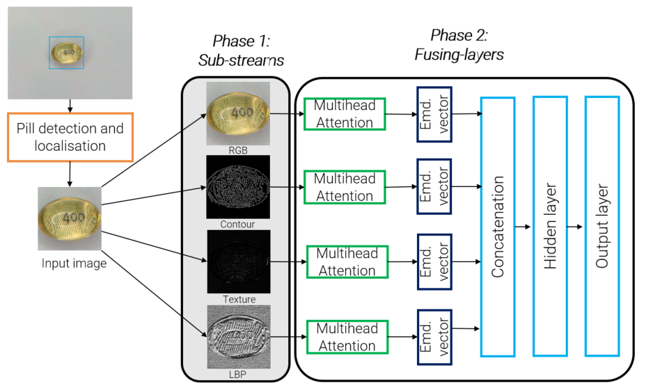
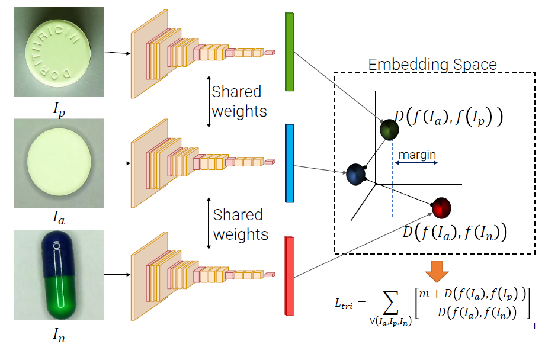

# 🩹 Multi-Stream Pill Recognition with Attention
We address the challenge of pill recognition by proposing a novel approach that utilizes a multi-stream network 
with EfficientNet-B0 and a self-attention mechanism. To get rid of the explicit training of printed or embossed 
patterns we used LBP features. For evaluation two datasets were utilized. In the test scenarios our proposed 
model outperformed the previous models in Top-1 and Top-5 accuracy, also the YOLOv7 network in a reference-quality 
use-case. 

## 📐 Architecture of the model

The training process is composed of two phases. First, each sub-stream is independently trained for metrics embedding
following the batch-all strategy, when any regular triplet can be used [1]. During the training of the high-level 
fusion network, only those input triplets are used which were too difficult to embed in the previous phase
(it is called hard triplet mining).

A simple strategy is to concatenate the output embedding
vectors of sub-streams and apply neural layers on them to
generate the final metrics embedding. Unfortunately,
this approach did not give satisfactory results with our
model. As an alternative to concatenation we implemented
the attention encoder of the famous mechanism. 
For the output embedding of each stream we computed self-attention
then concatenated the output of the
four streams. Finally, we added two dense layers, as in [1].

<figure align="center">
  
  <figcaption>Figure 1. Overview of the proposed architecture. The output hidden layer represents the input image in
the learned metrics space</figcaption>
</figure>


The idea behind using different sub-streams is to enforce the utilization of the different image features which might be useful for the different classes under different viewing conditions. The following sub-streams were implemented:

-  **RGB**: color images are directly fed to a CNN for metrics embedding. We preferred EfficientNet-B0 over the CNN of [1] 
since its well-optimized for similar tasks and has only 4.2 million parameters instead of 9 million.  
EfficientNet-B0 was used in all sub-streams but with smaller number of parameters due to grayscale input images.
-  **Contour**: images are generated by running the Canny edge detector on smoothed grayscale version of images (applying a 7×7 Gaussian kernel).
-  **Texture**: images are created by subtracting the smoothed and grayscale versions of pill images.
- **LBP**: it is an old but popular descriptor for many CV tasks including handwritten or printed OCR. 
That is the reason why we omitted OCR sub-streams in our implementations but computed the LBP images of the grayscale inputs.

<figure align="center">
  
  <figcaption>Figure 2. General overview of training sub-streams in Siamese
network structure. The size of EfficientNet-B0 feature vectors
is 128 for all streams except the RGB stream where it is 256.</figcaption>
</figure>


## 📊 Datasets
We used two datasets, namely:
* CURE [1], that is available  [online](https://drive.google.com/drive/folders/1dcqUaTSepplc4GAUC05mr9iReWVqaThN).
* Our custom-made one, entitled OGYEIV1 [3]. It can be accessed if you contact me via my e-mail address:[ radli.richard@mik.uni-pannon.hu]()

The comparison of the two datasets can be seen in the table below:

<table>
    <thead>
    <tr style="background-color: #00000f">
      <th></th>
      <th>CURE</th>
      <th>OGYEIV1</th>
    </tr>
  </thead>
  <tbody>
    <tr>
      <td>Number of pill classes</td>
      <td>196</td>
      <td>78</td>
    </tr>
    <tr>
      <td>Number of images</td>
      <td>8973</td>
      <td>3154</td>
    </tr>
    <tr>
      <td>Image resolution</td>
      <td>800×800 - 2448×2448</td>
      <td>2465×1683</td>
    </tr>
    <tr>
      <td>Instance per class</td>
      <td>40-50</td>
      <td>40-60</td>
    </tr>
    <tr>
      <td>Segmentation labels</td>
      <td>no</td>
      <td>fully</td>
    </tr>
    <tr>
      <td>Backgrounds</td>
      <td>6</td>
      <td>1</td>
    </tr>
    <tr>
      <td>Imprinted text labels</td>
      <td>yes</td>
      <td>yes</td>
    </tr>
  </tbody>
</table>


## 📋 Requirement
Make sure you have the following dependencies installed:

```bash
colorama>=0.4.6
colorlog>=6.7.0
json>=2.0.9
matplotlib>=3.7.1
numpy>=1.26
opencv-python>=4.5.5.64
pandas>=2.1.0
Pillow>=9.3.0
seaborn>=0.12.2
segmentation_models_pytorch>=0.3.3
skimage>=0.20.0
sklearn>=1.4.0
torch>=2.2.1
torchsummary>=1.5.1
torchvision>=0.15.1+cu117
tqdm>=4.65.0
```

Install dependencies with:
```bash
pip install -r requirements.txt
```

## 🚀 Installation

### 1. Clone or download the repository

Begin by cloning or downloading this repository to your local machine.

```bash
git clone https://github.com/richardRadli/pill_detection/tree/idaacs2023
```

### 2. Update configuration

Open the _data_paths.py_ file. You will find the following dictionary:

```python
root_mapping = {
    "your_username": {
        "STORAGE_ROOT ":
            "D:/storage/pill_detection/IDAACS23",
        "DATASET_ROOT":
            "D:/storage/pill_detection/IDAACS23/datasets",
        "PROJECT_ROOT":
            "C:/Users/ricsi/Documents/project/IVM",
    }
}
```

Replace "your_username" with your actual username. Run the following command in your terminal to confirm it:

```bash
whoami
```

Then update these paths:

#### STORAGE_ROOT:
* Adjust this path to the location where you want to save project outputs and other data generated during the execution 
of the Python files.

#### DATASET_ROOT:
* Modify this path to point to the directory where your datasets are stored. This folder should contain all datasets 
necessary for the project. It should look like this:

* D:\storage\pill_detection\IDAACS23\dataset
  * ogyei_v1
    * Customer
    * Reference
    * etc.

#### PROJECT_ROOT:
* Update this path to the directory where the Python and JSON files of the project are located.

### 3. Create necessary folders
Run the data_paths.py script. This will create all the required folders based on the paths specified in the 
configuration.

### 4. Download and place datasets
Obtain the necessary datasets and place them into the DATASET_ROOT directory as specified in your updated configuration.

## 💻 Usage

### Setting Up Configuration Files

Before running the Python scripts, you can configure your settings in the following JSON files:

* `augmentation_config.json` - Configuration for augmentation
* `fusion_net_config.json` - Configuration for training the fusion network
* `streamnet_config.json` - Configuration for training the stream networks
* `stream_images_config.json` - Configuration for image manipulation for the stream images
* `unet_config.json` - Configuration for training the UNET

### Running the Pipeline
After updating paths and placing datasets, follow these steps to complete setup and training:
 
1. **Generate Augmented Images**
   * Run `augment_images.py` to create augmented image versions for training.
 
2. **Train UNet Segmentation**
   * Train the UNet model with the augmented images and masks using train_unet.py.
 
3. **Generate Test Mask Images**
   * Use `test_unet.py` to create mask images for testing.
 
4. **Generate Mask Images for Stream Training**
   * Run `draw_masks.py` to generate mask images needed for training stream networks.
 
5. **Create Stream Images** 
   * Generate RGB, contour, LBP, and texture stream images with `create_stream_images.py`.
   
6. **Train Stream Networks** 
   * Train each of the four stream networks by running `train_stream_network.py`.
   
7. **Train Fusion Network**
   * After all stream networks are trained, use `train_fusion_network.py` to train the final fusion network.

9. **Evaluate Results** 
   * Run `predict_fusion_network.py` to evaluate the model and view the results.


## 📝 References
[1] - Ling, S., Pastor, A., Li, J., Che, Z., Wang, J., Kim, J., & Callet, P. L. (2020). Few-shot pill recognition. 
In Proceedings of the IEEE/CVF Conference on Computer Vision and Pattern Recognition (pp. 9789-9798).

[2] - Tan, M., & Le, Q. (2019, May). Efficientnet: Rethinking model scaling for convolutional neural networks. 
In International conference on machine learning (pp. 6105-6114). PMLR.

[3] - Rádli, R., Vörösházi, Z., & Czúni, L. (2023, September). Multi-Stream Pill Recognition with Attention. 
In 2023 IEEE 12th International Conference on Intelligent Data Acquisition and Advanced Computing Systems: 
Technology and Applications (IDAACS) (Vol. 1, pp. 942-946). IEEE.