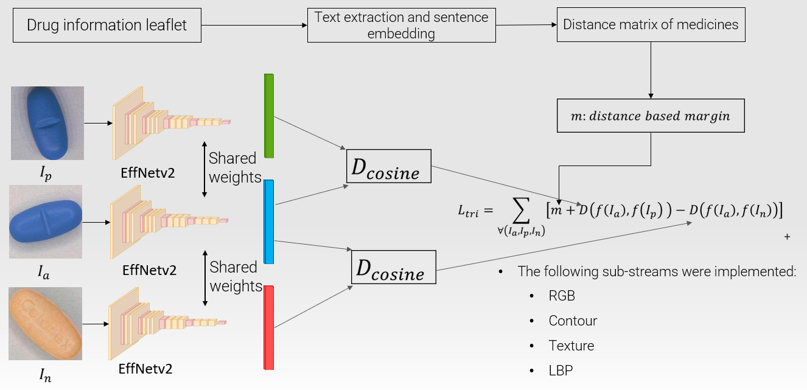
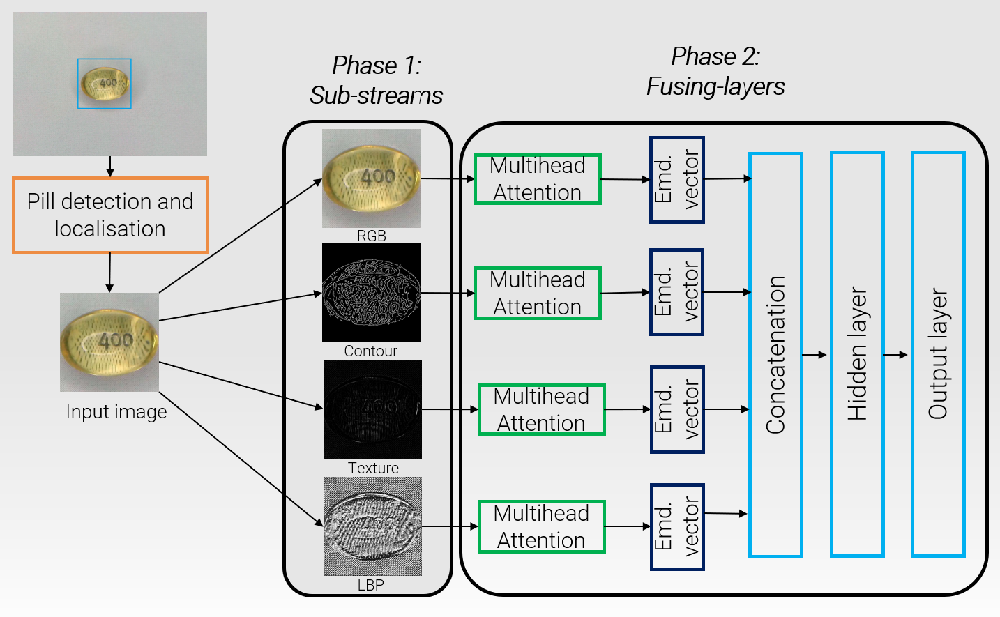

# Image and Word Embeddings in Pill Recognition
Pill recognition is a key task in healthcare and has a wide range of applications. In this study, we are  addressing
the challenge to improve the accuracy of pill recognition in a metrics learning framework. A multi-stream visual 
feature extraction and processing architecture, with multi-head attention layers, is used to estimate the similarity 
of pills. We are introducing an essential enhancement to the triplet loss function to leverage word embeddings for 
the injection of textual pill similarity into the visual model. This improvement refines the visual embedding on a 
finer scale than conventional triplet loss models resulting in higher accuracy of the visual model. 
Experiments and evaluations are made on a new pill dataset, freely available.

## Architecture of the model

The implementation of different sub-streams is motivated by the intention to enforce the extraction and utilization 
of various image features that may be beneficial in different circumstances and for different types of pills. 
Our approach implements the following sub-streams:


-  Contour-stream: Contour images are produced by applying the Canny edge detector on a smoothed grayscale 
representation of the images, performed by a 7×7 Gaussian convolution kernel.
-  LBP-stream: LBP, a widely adopted handcrafted local descriptor, finds application in numerous computer vision tasks,
such as OCR (for both handwritten and printed text). We computed LBP representations from the grayscale inputs and 
integrated them into the same type of streams as the other descriptors.
-  RGB-stream: For RGB images, colour representations are directly fed into the embedding deep neural network.
-  Texture-stream: The images are generated by the subtraction of the smoothed grayscale representations from the original
(grayscale) pill images.

<figure align="center">
  <figcaption>Phase 1</figcaption>
  
</figure>

All streams received the bounding box defined pill images of resolution 224×224 detected by YOLOv7 as described above.
Before the concatenation of the embedding vectors we implemented the attention encoder in each stream. 
To fuse the information of the streams we concatenated the output vectors and applied full connections in one hidden 
and one output layer to generate the final embedding. During the training of the fusion network streams were frozen 
and only the top layers were trained.

<figure align="center">
  <figcaption>Phase 2</figcaption>
  
</figure>


## Datasets
We used two datasets, namely CURE [1] and our novel, custom-made one, entitled OGYEIv2 [3]. 
CURE is available online via this link:

https://drive.google.com/drive/folders/1dcqUaTSepplc4GAUC05mr9iReWVqaThN.

Ours can be accessed by Kaggle:

https://www.kaggle.com/datasets/richardradli/ogyeiv2

The comparison of the two datasets can be seen in the table below:

|                              | CURE                | OGYEIv2   |
|------------------------------|---------------------|-----------|
| Number of pill classes       | 196                 | 112       |
| Number of images             | 8973                | 4480      |
| Raw image resolution         | 800×800 - 2448×2448 | 3840×2160 |
| Undistorted image resolution | -                   | 3746×2019 |
| Instance per class           | 40-50               | 40        |
| Segmentation labels          | no                  | fully     |
| Backgrounds                  | 6                   | 1         | 
| Free-text description        | no                  | yes       |

## Requirement
Make sure you have the following dependencies installed:

```bash
colorama>=0.4.6
colorlog>=6.7.0
docx2txt>=0.8.0
json>=2.0.9
fuzzywuzzy>=0.18.0
fuzzysearch>=0.7.3
matplotlib>=3.7.1
numpy>=1.23.5
opencv-python>=4.5.5.64
openpyxl>=3.1.2
pandas>=2.0.0
Pillow>=9.3.0
scipy>=1.10.1
seaborn>=0.12.2
segmentation_models_pytorch>=0.3.3
skimage>=0.20.0
sklearn>=1.2.2
spacy>=3.6.1
tkinter>=8.6.12
torch>=2.0.0+cu117
torchsummary>=1.5.1
torchvision>=0.15.1+cu117
tqdm>=4.65.0
yellowbrick>=1.5
```

## Installation
First, clone/download this repository. In the const.py file you will find this:

```python
root_mapping = {
    'ricsi': {
        "PROJECT_ROOT": 'D:/pill_detect/storage/',
        "DATASET_ROOT": 'D:/pill_detect/datasets'
    }
}
```

- Update the designated username ('ricsi') to reflect the username associated with your logged-in operating system.
- Utilize PROJECT_ROOT as the central repository for storing essential data.
- Employ DATASET_ROOT as the designated directory for managing datasets integral to the functioning of the project.
- const.py will create all the necessary folders.
- Download the datasets and place them into the appropriate folders.


## Overview of the repository
In the config.py file, key parameters and settings crucial for the training, testing, and data augmentation processes 
are centrally stored. These configurations provide a streamlined and organized approach to manage various aspects 
of the project, ensuring adaptability and ease of customization.

To create a dataset, we attached a couple of scripts for image capturing. Steps to create a dataset:

- Use `take_calibration_images.py`, and capture images for camera calibration. The more images are taken, 
better the results will be.
- Use `camera_calibration.py` to calibrate the camera.
- Use `camera_recording.py`, and create the image dataset.
- Finally, use `undistort_images.py` to undistort the taken images.

A couple of useful scripts are also part of this repository, these files can be found in the **dataset_operations** folder.
These tools are handful, if you wish to make operations on the datasets, such as splitting, checking the balance and
annotations, etc. Also, it is worth pointing out to the `utils.py` script, that has many useful functions.

## Usage

If the repository is cloned/downloaded, the root paths are sorted out, the datasets are in place, and everything is 
set up in the config files, the next step is to apply a trained YOLOv7 network for pill detection and use 
`crop_yolo_detected_images.py` on the detected images. For more details read our article [3]. 

Alternatively, if you can use `draw_masks.py` to create the binary mask images.

To create the images for the streams, run `create_stream_images.py`. Make sure you go through all the choices of 
the argument called **dataset_operation** in the **ConfigStreamNetwork** class in the `config.py` file (train, valid, test).

Next step is to train the stream networks, this is Phase 1. 
There is only one type of backbone is available for this, EfficientNet V2 s [2]. 
Make sure you train all four streams. Also, two loss functions are provided:
triplet loss and dynamic margin triplet loss. The later needs an .xslx file, named 20xx-xx-xx_xx-xx-xx_vector_distances.xlsx

To generate this .xlsx file, first run the `pill_feature_extraction.py` script, than use the `text_nlp_analysis.py` file.
Most importantly, the first script will look for the information leaflets, place them into the following folder:
**".\storage\pill_detection\nlp\documents\patient_information_leaflet_doc"**

After the streams are trained, the last step is to train the fusion network, it is also called Phase 2.

To evaluate the models, use `predict_fusion_network.py`.

## References
[1] - Ling, S., Pastor, A., Li, J., Che, Z., Wang, J., Kim, J., & Callet, P. L. (2020). Few-shot pill recognition. 
In Proceedings of the IEEE/CVF Conference on Computer Vision and Pattern Recognition (pp. 9789-9798).

[2] - Tan, M., & Le, Q. (2021, July). Efficientnetv2: Smaller models and faster training. 
In International conference on machine learning (pp. 10096-10106). PMLR.

[3] - Rádli, R.; Vörösházi, Z. and Czúni, L. (2024). Word and Image Embeddings in Pill Recognition 

